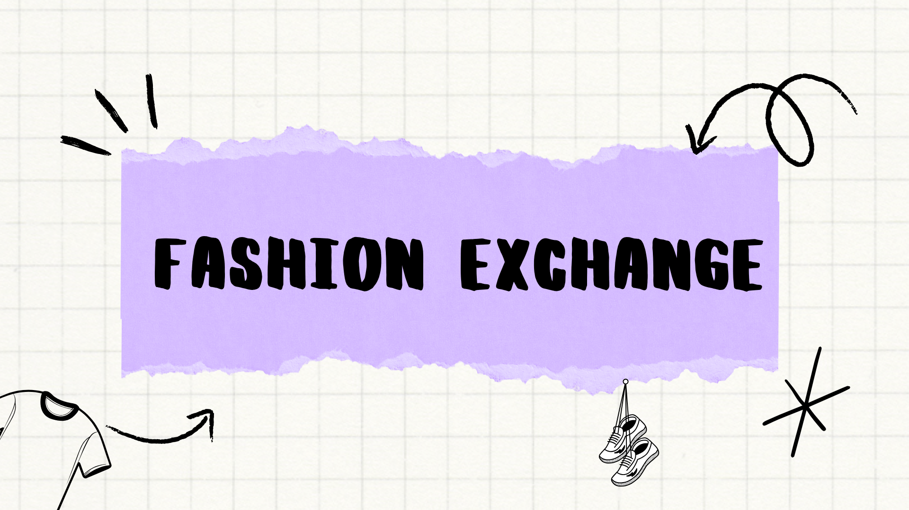

### To know details about the project:
[Know More About the Project ](https://www.canva.com/design/DAGOgpNaNZI/-SHGfEvIWklq2RG7Sm-tWg/view?utm_content=DAGOgpNaNZI&utm_campaign=designshare&utm_medium=link2&utm_source=uniquelinks&utlId=h8df6a57914#16)

### Backend & Other Associated Repositories:
- **FX Main Backend**: [Redirect](https://github.com/Adeesh-bode/fx-backend)
- **FX Model**: [Redirect](https://github.com/Adeesh-bode/FXModel)
This is readme.md
